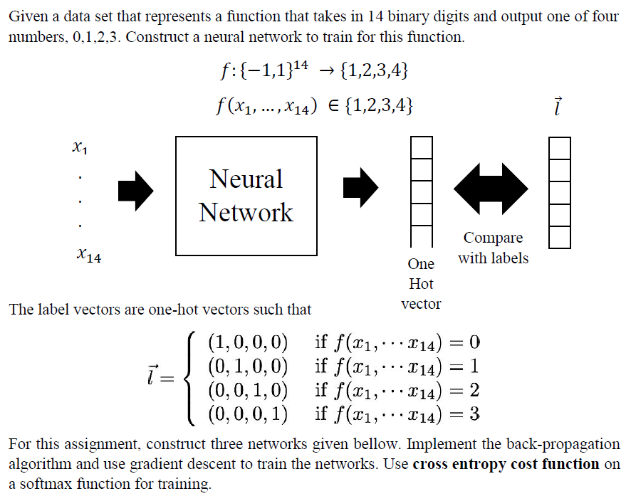

# Neural Network from scratch in Python 3.6.x
This is a simple implementation of neural networks using Python 3.6.x from scratch, meaning that it doesn't apply any framework like TensorFlow, Keras etc. This is just for my practicing and better understanding in the topic.

This was given as an assignment problem in 'CS5242 Deep Learning' module at National University of Singapore (AY 2018/19 Sem 1).
___
## Problem Statement
